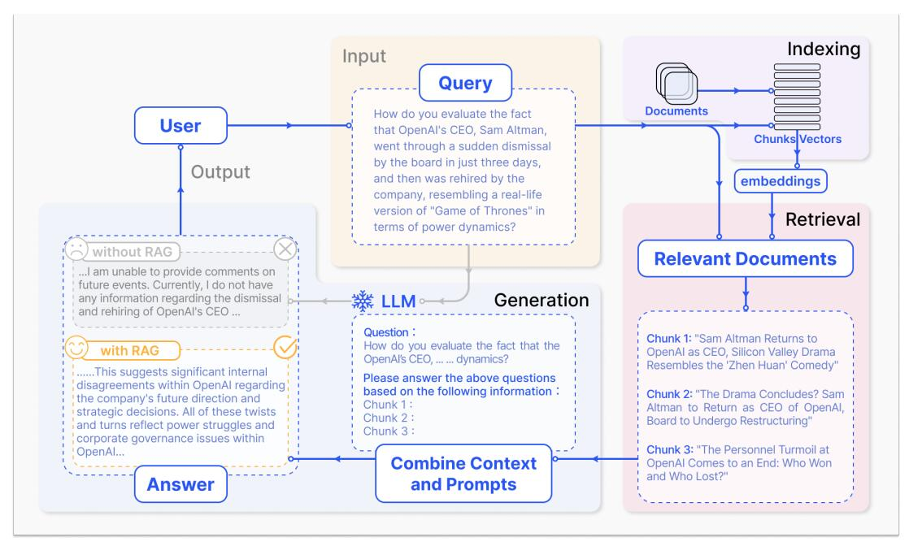

# 社交媒体海量文本检索任务

## 一、任务目标/条件:

1. 海量数据。
2. 返回上下文。
3. 模糊查找匹配。


## 二、解决方案：

### 1）海量数据：

**解决方案**：使用向量数据库分级存放。[`向量数据库有各种类型`](https://python.langchain.com/v0.1/docs/integrations/vectorstores/),
下面以Faiss数据库举例


### 2）返回上下文：

**解决方案**：使用[`分词器`](https://python.langchain.com/v0.1/docs/modules/data_connection/document_transformers/)分段，每次匹配和检索就查找每个text chunk即可：

```
text_splitter = CharacterTextSplitter(chunk_size=100, chunk_overlap=0)
docs = text_splitter.split_documents(documents)
ps: 具体分段的数量和方法有很多细节，需要根据任务需求定制。
```


### 3）模糊查找匹配：

**解决方案**：使用向量数据库匹配查找+LLM增强检索，即[`Retrieval-Augmented Generation (RAG)`](https://arxiv.org/pdf/2312.10997)。实现流程如下：

<p align="center">
    
<p>
<br>

1. 数据分割，并数据向量化：将非结构化数据分割后，再通过Embedding Model转换为向量表示，然后存储到向量数据库中。
2. 相似度匹配查找：当回答问题时，根据问题xxxx中的关键词和数据库中的文本进行相似度匹配，找到最接近的内容yyyy。
3. 重构问题送入llm：根据查找的内容yyyy和问题xxxx组成新prompt，类似“请根据素材内容yyyy，对问题xxxx进行回答”。将新的prompt送入模型得到answer。


## 三、实验效果

1）检索任务：使用[`Twitter.txt`](https://gitee.com/dengxw66/MKT_data_mining/blob/master/DB/db_retrieval/Twitter.txt)的数据，运行[`vector_db.ipynb`](https://gitee.com/dengxw66/MKT_data_mining/blob/master/DB/db_retrieval/vector_db.ipynb)。

结果见[`vector_db.ipynb`](https://gitee.com/dengxw66/MKT_data_mining/blob/master/DB/db_retrieval/vector_db.ipynb)中。可以看到有效的检索出了类似的前k个向量的上下文。

```
retriever = db.as_retriever(search_kwargs={"k": 15}) # 数据量大的时候调整k的值，控制返回最匹配的前k个结果即可。
docs = retriever.invoke("multimodal,image,text")
```

2）提问任务：使用[`medicine.txt`](https://gitee.com/dengxw66/MKT_data_mining/blob/master/DB/document_ans/medicine.txt)的数据，运行[`GLM_RAG_answer.ipynb`](https://gitee.com/dengxw66/MKT_data_mining/blob/master/DB/document_ans/GLM_RAG_answer.ipynb)。

结果见[`GLM_RAG_answer.ipynb`](https://gitee.com/dengxw66/MKT_data_mining/blob/master/DB/document_ans/GLM_RAG_answer.ipynb)中。可以看到有效的结合文本内容使用LLM进行了提问。

```
# 使用RAG检索数据库增强专家知识
qa = RetrievalQA.from_chain_type(llm=llm, chain_type="stuff", retriever=db.as_retriever())
query = "根据文档内容,请说明靶向药具体被如何使用?" # 根据不同的业务要求，LLM可以用数据库检索和定制不同的回答
qa.run(query)
```


