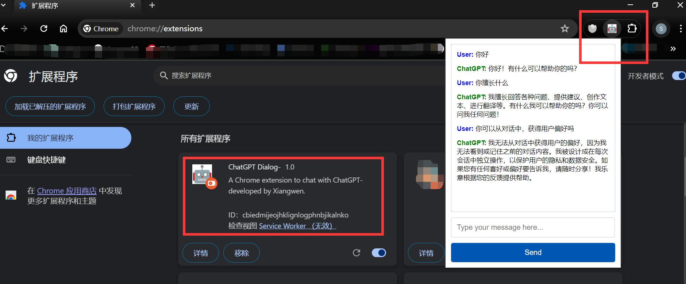

# Chrome plugin for GPT dialogue

## 

## install

1. Download the plugin from GitHub 🐙
2. Unpack the zip 📦
3. Open the file and replace `const apiKey = "sk-xxxxxxxxxxxxxxxxxxxxxxxxxxxxxxxxxxxxxxxxx"`; with your actual API key from OpenAI 🔑popup.js
4. Go to the Chrome extensions page chrome://extensions/ 📁
5. Enable Developer Mode by clicking the toggle switch in the top right corner
6. Click the "Load Unpacked" button and select the "GPT-talk" folder
7. GPT-talk should now be installed and visible in your Chrome extensions 🎉

## sample effect:

    

 

