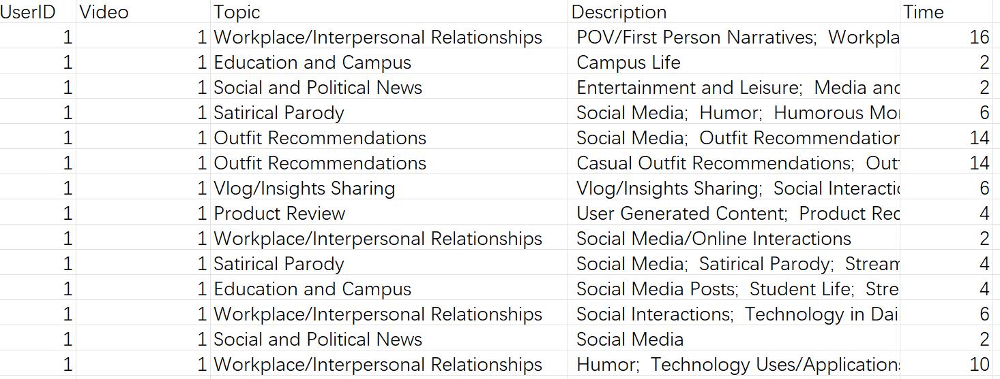
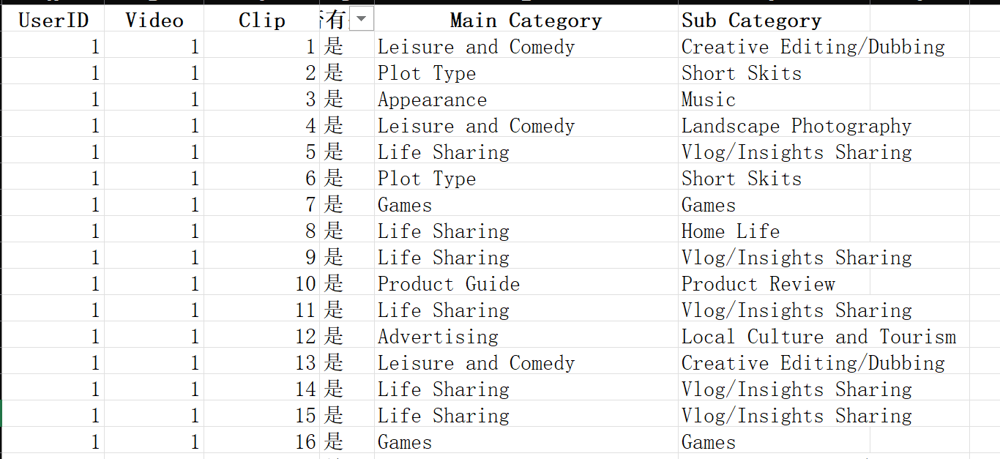

# 准确率计算

核心结论：

1. 曝光不足的视频(<2s的视频) 匹配：
    - 总平均准确率 大致43%
    - 典型问题：有些视帧间变化过大(甚至有黑屏)，这时模型无法继续识别为同一类。因为chat history不够长。如果让llm更多的参考前几帧的结果/提高chat history长度，应该会减少错误分类的情况。

2. 曝光充足的视频(>2s的视频) 匹配：

    | Type  | 匹配数量对应      | 字符匹配标准       | 准确率  |
    |-------|----------------|------------------|--------|
    | type1 | 一对一匹配         | main category一致    | 19.9%  |
    | type2 | 一对一匹配         | sub category一致    | 1.9%  |
    | type3 | 多对一匹配         | main category一致    | 81.2%  |
    | type4 | 多对一匹配        | sub category一致     | 33.8%  |


- 一对一匹配：使用llm中Topic与human中的main category进行一对一匹配，忽略llm的description中的其他category。
- 多对一匹配：只要要llm的description的多个label 能cover human的分类（即只要存在某个项一致），就算匹配。
- main category：根据Fig.1,分类标准，只要main category是同一类就算做匹配
- sub category：根据Fig.1,分类标准，需要sub category一致才算做匹配

# 1. 数据格式

<p align="center">
    
    <br>
    <strong>Fig.1, 分类标准 main category和sub category</strong>
</p>

## 1.1. llm
有文件：[`DatafromLLM.xlsx`](https://github.com/dengxw66/MKT_data_mining/tree/master/Multimodal/image2text/accuracy/DatafromLLM.xlsx)，其中的格式是


<p align="center">
    
    <br>
    <strong>Fig.2, LLM格式：UserID,	Video,	Topic,	Description,	Time
    </strong>
</p>

## 1.2 human
有文件：[`DatafromRA.xlsx`](https://github.com/dengxw66/MKT_data_mining/tree/master/Multimodal/image2text/accuracy/DatafromRA.xlsx)，其中的格式是
 
<p align="center">
    
    <br>
    <strong>Fig.3, human格式：UserID,	Video,	Clip,	是否有效曝光	, Main Category,	Sub Category
    </strong>
</p>


# 2. 匹配规则


1. 曝光不足的视频(<2s的视频)：
    - 方法：检测每个用户此类视频的个数。
    - 备注：因为human文件中"是否有效曝光"没有具体主题，所以只能匹配个数。
2. 曝光充足的视频(>2s的视频)：
    - 方法：按次序逐个匹配，检测每个视频的主题是否一致。
    - 分为单分类匹配和多分类匹配，具体匹配也分为大类匹配或子类匹配
    - 备注：因为human文件中没有每段视频时长，所以只能匹配主题次序和类型。


# 3 结果展示：曝光不足的视频(<2s的视频)匹配

## 3.1 文件：
每一项具体结果见 [`MatchedData_2.csv`](https://github.com/dengxw66/MKT_data_mining/tree/master/Multimodal/image2text/accuracy/MatchedData_2.csv)，
匹配统计结果见：[`accuracy_results_2.txt`](https://github.com/dengxw66/MKT_data_mining/tree/master/Multimodal/image2text/accuracy/accuracy_results_2.txt)


## 3.2 结果：
准确率 Average Match Rate for Each UserID:

| UserID | 1     | 3     | 4     | 6     | 8     | 9     | 10    | 11    | 13    | 14    | 15    | 16    | 17    | 18    |
|--------|-------|-------|-------|-------|-------|-------|-------|-------|-------|-------|-------|-------|-------|-------|
| Rate   | 0.227 | 0.452 | 0.267 | 0.520 | 0.544 | 0.336 | 0.577 | 0.385 | 0.452 | 0.535 | 0.311 | 0.504 | 0.371 | 0.572 |

| UserID | 20    | 21    | 23    | 24    | 25    | 26    | 28    | 29    | 31    | 33    | 34    | 35    | 36    | 37    |
|--------|-------|-------|-------|-------|-------|-------|-------|-------|-------|-------|-------|-------|-------|-------|
| Rate   | 0.555 | 0.338 | 0.746 | 0.505 | 0.588 | 0.389 | 0.233 | 0.417 | 0.502 | 0.324 | 0.393 | 0.561 | 0.303 | 0.175 |

- 计算公式：每个video的准确率平均值，即 (准确率1+准确率2+准确率3+...准确率n)/n
- 总准确率是：0.4321


## 3.3 问题：
1. 发现llm小于2s的数量太多：
    - 原因：有些视帧间变化过大(甚至有黑屏)，模型无法有效识别为同一类。
    - 后续解决方法：加大history的阈值，之前是读取前1次的chat为histroy，后续应该要提高阈值，读取前3次的chat为history。保证前3帧中只要出现了相似内容，也可以尽量分为同一类.


# 4. 结果展示：曝光充足的视频(>2s的视频) 


## 4.1 一对一匹配

- 使用llm中Topic与human进行一对一匹配，忽略llm的description中的其他category。更多细节见，附录4.1 代码见：[`data.ipynb`](https://github.com/dengxw66/MKT_data_mining/tree/master/Multimodal/image2text/accuracy/data.ipynb)

- 源文件格式：
    - LLM见 [`DatafromLLM_Main_Categories.csv`](https://github.com/dengxw66/MKT_data_mining/tree/master/Multimodal/image2text/accuracy/DatafromLLM_Main_Categories.csv)
    - human见 [`DatafromRA_Main_Categories.csv`](https://github.com/dengxw66/MKT_data_mining/tree/master/Multimodal/image2text/accuracy/DatafromRA_Main_Categories.csv)

### 4.1.1 main category匹配

- 规则：只要main category是同一类就算做匹配
- 每一项具体结果见 [`MatchedData_CategorySequences_single.csv`](https://github.com/dengxw66/MKT_data_mining/tree/master/Multimodal/image2text/accuracy/MatchedData_CategorySequences.csv)，
- 匹配统计结果见：[`accuracy_results_singlematch_maincategory.txt`](https://github.com/dengxw66/MKT_data_mining/tree/master/Multimodal/image2text/accuracy/accuracy_results.txt)


- 结果：
Average Match Rate for Each UserID:

| UserID | 1     | 3     | 4     | 6     | 8     | 9     | 10    | 11    | 13    | 14    | 15    | 16    | 17    | 18    |
|--------|-------|-------|-------|-------|-------|-------|-------|-------|-------|-------|-------|-------|-------|-------|
| Rate   | 0.127 | 0.298 | 0.272 | 0.113 | 0.049 | 0.159 | 0.210 | 0.131 | 0.128 | 0.180 | 0.243 | 0.099 | 0.473 | 0.151 |

| UserID | 20    | 21    | 23    | 24    | 25    | 26    | 28    | 29    | 31    | 33    | 34    | 35    | 36    | 37    |
|--------|-------|-------|-------|-------|-------|-------|-------|-------|-------|-------|-------|-------|-------|-------|
| Rate   | 0.292 | 0.160 | 0.151 | 0.114 | 0.181 | 0.205 | 0.234 | 0.148 | 0.293 | 0.058 | 0.246 | 0.124 | 0.439 | 0.173 |
- 计算公式：每个video的准确率平均值，即 (准确率1+准确率2+准确率3+...准确率n)/n:
- 总准确率是：0.19996


### 4.1.2 sub category匹配
- 规则：必须sub category是一致才算做匹配
- 每一项具体结果见 [`MatchedData_CategorySequences_single2.csv`](https://github.com/dengxw66/MKT_data_mining/tree/master/Multimodal/image2text/accuracy/MatchedData_CategorySequences_single2.csv)，
- 匹配统计结果见：[`accuracy_results_singlematch_subcategory.txt`](https://github.com/dengxw66/MKT_data_mining/tree/master/Multimodal/image2text/accuracy/accuracy_results_singlematch_subcategory.txt)

- 结果：

Average Match Rate for Each UserID:

| UserID | 1      | 3      | 4      | 6      | 8      | 9      | 10     | 11     | 13     | 14     | 15     | 16     | 17     | 18     |
|--------|--------|--------|--------|--------|--------|--------|--------|--------|--------|--------|--------|--------|--------|--------|
| Rate   | 0.009  | 0.000  | 0.000  | 0.000  | 0.000  | 0.000  | 0.000  | 0.000  | 0.000  | 0.000  | 0.020  | 0.000  | 0.000  | 0.000  |

| UserID | 20     | 21     | 23     | 24     | 25     | 26     | 28     | 29     | 31     | 33     | 34     | 35     | 36     | 37     |
|--------|--------|--------|--------|--------|--------|--------|--------|--------|--------|--------|--------|--------|--------|--------|
| Rate   | 0.009  | 0.008  | 0.000  | 0.014  | 0.008  | 0.056  | 0.000  | 0.029  | 0.000  | 0.020  | 0.074  | 0.019  | 0.122  | 0.000  |

- 计算公式：每个video的准确率平均值，即 (准确率1 + 准确率2 + 准确率3 + ... + 准确率n) / n
- 总准确率是：0.019


###  4.1.3 问题：
1. llm和human得到的clip数目不一致：
    - 原因：因为有些错误分割的情况，导致同一个视频片段可能被分为了多个clip和topic
    - 处理方法：保证先后顺序即可。即 只计算 符合先后出现顺序的clip，中间如果有杂项输入则忽略。具体计算规则见4.1附录。
2. 同一个视频的分类topic不一致：
    - 原因：llm的输出主题一般有多个，而human只统计了一个主题。因此先前步骤，将llm的多个topic输出，通过word-embedding向量相似度，选取了最具有代表性topic的作为这个片段的最终topic。
        - (值得一提的是，实际上一个视频可以归于多个主题，感觉是make sense的)
    - 处理方法：大类匹配，不考虑sub category，如果属于同一个大类就算匹配。

## 4.2 多对一匹配

- 由于llm能得到同一个视频的多分类结果（见Fig.2, description），因此进行多分类匹配算法。
    - 多对一匹配规则：每个视频片段，只要llm的description 多分类中能cover human的分类（即只要存在某个项一致），就算匹配。更多细节见，附录4.2 代码见：[`data_multi-category.ipynb`](https://github.com/dengxw66/MKT_data_mining/tree/master/Multimodal/image2text/accuracy/data_multi-category.ipynb)

- 源文件格式：
    - LLM见 [`DatafromLLM_Main_Categories_combined.csv`](https://github.com/dengxw66/MKT_data_mining/tree/master/Multimodal/image2text/accuracy/DatafromLLM_Main_Categories_combined.csv)
    - human见 [`DatafromRA_Main_Categoriess_combined.csv`](https://github.com/dengxw66/MKT_data_mining/tree/master/Multimodal/image2text/accuracy/DatafromRA_Main_Categoriess_combined.csv)

### 4.2.1 main category匹配

- 规则：只要main category是同一类就算做匹配

- 每一项具体结果见 [`MatchedData_CategorySequences_combined.csv`](https://github.com/dengxw66/MKT_data_mining/tree/master/Multimodal/image2text/accuracy/MatchedData_CategorySequences_combined.csv)，
- 匹配统计结果见：[`accuracy_results_multimatch-maincategory.txt`](https://github.com/dengxw66/MKT_data_mining/tree/master/Multimodal/image2text/accuracy/accuracy_results_multimatch-maincategory.txt)
 
- 结果：
Average Match Rate for Each UserID:

| UserID | 1      | 3      | 4      | 6      | 8      | 9      | 10     | 11     | 13     | 14     | 15     | 16     | 17     | 18     |
|--------|--------|--------|--------|--------|--------|--------|--------|--------|--------|--------|--------|--------|--------|--------|
| Rate   | 0.767  | 0.899  | 0.833  | 0.681  | 0.582  | 0.787  | 0.783  | 0.794  | 0.865  | 0.898  | 0.864  | 0.816  | 0.958  | 0.802  |

| UserID | 20     | 21     | 23     | 24     | 25     | 26     | 28     | 29     | 31     | 33     | 34     | 35     | 36     | 37     |
|--------|--------|--------|--------|--------|--------|--------|--------|--------|--------|--------|--------|--------|--------|--------|
| Rate   | 0.851  | 0.823  | 0.867  | 0.741  | 0.828  | 0.843  | 0.881  | 0.859  | 0.903  | 0.812  | 0.766  | 0.811  | 0.912  | 0.899  |

- 计算公式：每个video的准确率平均值，即 (准确率1 + 准确率2 + 准确率3 + ... + 准确率n) / n
- 总准确率是：0.812


### 4.2.2 sub category匹配

- 规则：必须sub category是一致才算做匹配

- 每一项具体结果见 [`MatchedData_CategorySequences_combined2.csv`](https://github.com/dengxw66/MKT_data_mining/tree/master/Multimodal/image2text/accuracy/MatchedData_CategorySequences_combined2.csv)，
- 匹配统计结果见：[`accuracy_results_multimatch-subcategory.txt`](https://github.com/dengxw66/MKT_data_mining/tree/master/Multimodal/image2text/accuracy/accuracy_results_multimatch-subcategory.txt)
 

- 结果：Average Match Rate for Each UserID:

| UserID | 1      | 3      | 4      | 6      | 8      | 9      | 10     | 11     | 13     | 14     | 15     | 16     | 17     | 18     |
|--------|--------|--------|--------|--------|--------|--------|--------|--------|--------|--------|--------|--------|--------|--------|
| Rate   | 0.323  | 0.447  | 0.162  | 0.203  | 0.179  | 0.252  | 0.341  | 0.563  | 0.314  | 0.334  | 0.412  | 0.158  | 0.252  | 0.240  |

| UserID | 20     | 21     | 23     | 24     | 25     | 26     | 28     | 29     | 31     | 33     | 34     | 35     | 36     | 37     |
|--------|--------|--------|--------|--------|--------|--------|--------|--------|--------|--------|--------|--------|--------|--------|
| Rate   | 0.313  | 0.259  | 0.328  | 0.306  | 0.218  | 0.523  | 0.312  | 0.366  | 0.242  | 0.479  | 0.517  | 0.477  | 0.631  | 0.306  |

- 计算公式：每个video的准确率平均值，即 (准确率1 + 准确率2 + 准确率3 + ... + 准确率n) / n
- 总准确率是：0.338


# 4. 附录(具体顺序匹配规则)


## 4.1 单分类匹配算法

具体匹配规则是用llm和human中，长的list去匹配短的list。即我定义短的list是ground truth，更长的list因为有些错误clip插入，才导致更长。因此，计算长的list里面有多少是满足短list顺序的子片段，即为匹配数目。

- 例，比如有:
    - m=[a,b,c,d,e,f,g,h,k],
    - n=[a,c,b,c,f,d,e,f,h,g,h,a,k],
    - q=[a,c,b,c ,f,h,g,h,a,k]
1. m和n匹配的数量为9，因为n可以分为：a,(c),b,c,(f),d,e,f,(h),g,h,(a),k。去掉不匹配的c,f,h,a，其余的a,b,c,d,e,f,g,h,k和m中的a,b,c,d,e,f,g,h,k次序一致。
2. m和q匹配的数量为7，因为q可以分为a,(c),b,c, f,(h),g,h,(a),k。其中a,b,c,f,g,h,k是按照m的顺序出现的（尽管中间有中断d和e，但是没有关系，其余是按照顺序出现即可）


## 4.2 多分类匹配算法：


### 示例 1
```plaintext
llm_list = [[a, b], [c], [d, e, a], [f], [g, k, h], [i], [j, k]]
ra_list = [[a], [e], [g], [i]]
```

1. **找出 llm_list 中出现 ra_list 的字符的位置**:
   - `a` 出现在 llm_list 的 `[a, b]` 和 `[d, e, a]`
   - `e` 出现在 llm_list 的 `[d, e, a]`
   - `g` 出现在 llm_list 的 `[g, k, h]`
   - `i` 出现在 llm_list 的 `[i]`

2. **从 llm_list 中找出这些字符的出现顺序**:
   - 出现顺序为 `[a, e, a, g, i]`

3. **找到符合 ra_list 顺序的最大匹配子序列**:
   - 符合顺序的子序列有：`[a, g, i]`，`[a, e, g, i]`（去掉中间的 `a` 也算匹配）

4. **最长匹配子序列的长度**:
   - 最长匹配子序列是 `[a, e, g, i]`，长度为 4

### 示例 2
```plaintext
llm_list = [[1, 2], [5], [3, 6, 9], [4, 5], [6], [7, 8]]
ra_list = [[1], [3], [4], [6], [7]]
```

1. **找出 llm_list 中出现 ra_list 的字符的位置**:
   - `1` 出现在 llm_list 的 `[1, 2]`
   - `3` 出现在 llm_list 的 `[3, 6, 9]`
   - `4` 出现在 llm_list 的 `[4, 5]`
   - `6` 出现在 llm_list 的 `[3, 6, 9]` 和 `[6]`
   - `7` 出现在 llm_list 的 `[7, 8]`

2. **从 llm_list 中找出这些字符的出现顺序**:
   - 出现顺序为 `[1, 3, 6, 4, 6, 7]`

3. **找到符合 ra_list 顺序的最大匹配子序列**:
   - 符合顺序的子序列有：`[1, 3, 4, 6, 7]`

4. **最长匹配子序列的长度**:
   - 最长匹配子序列是 `[1, 3, 4, 6, 7]`，长度为 5

