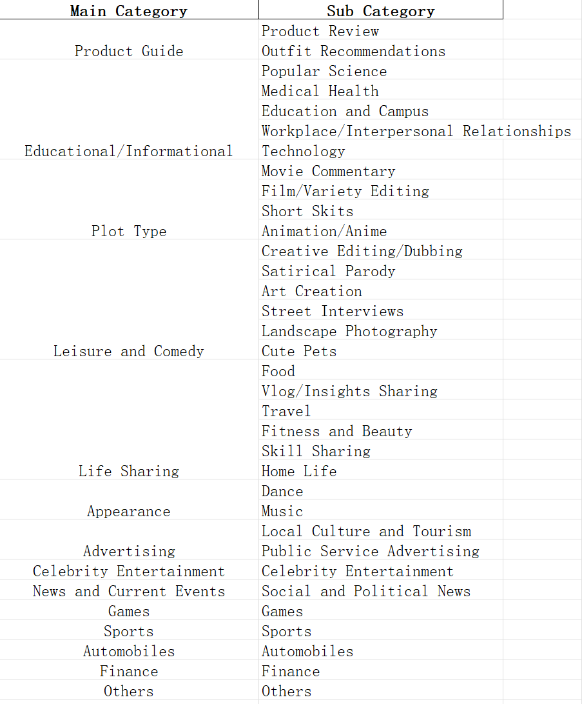
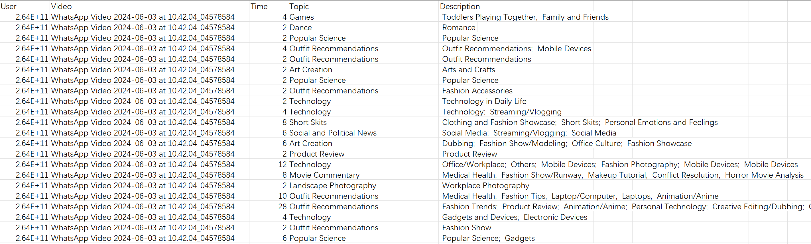
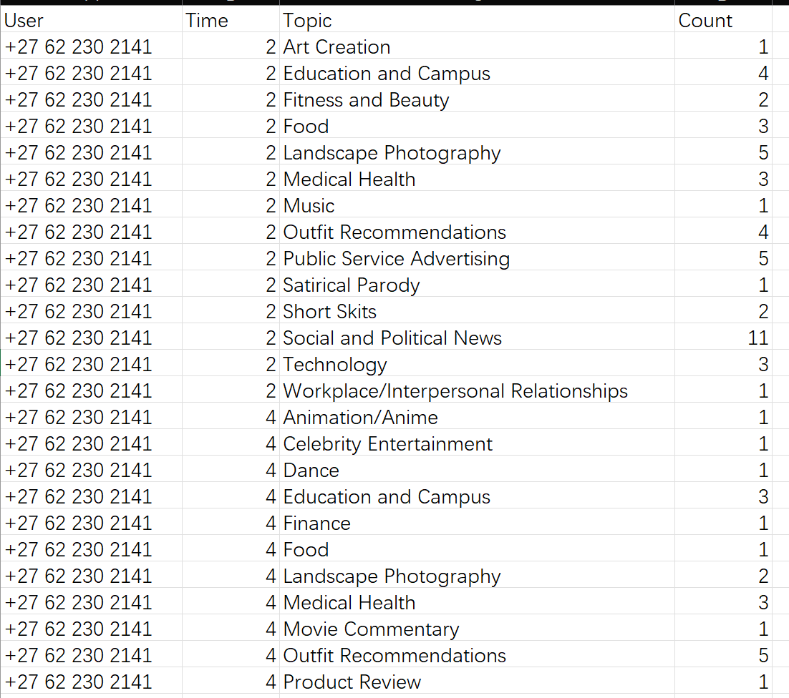
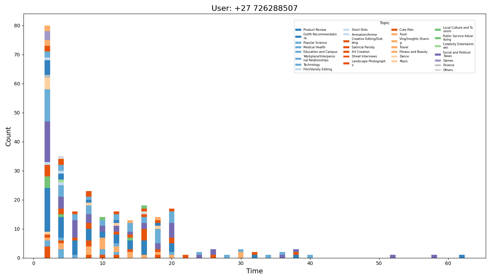
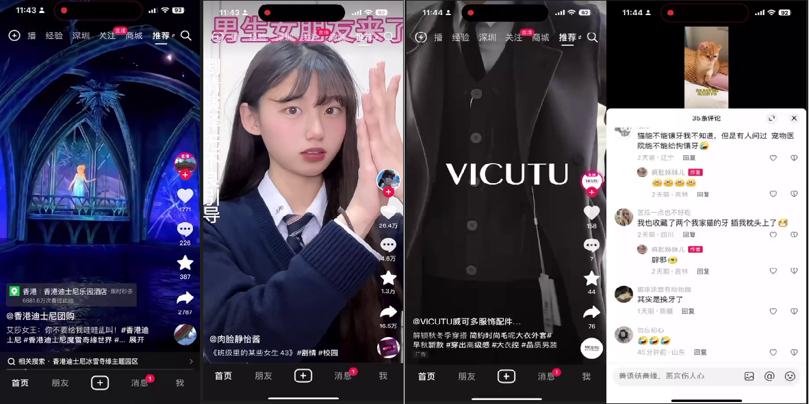

# social media 多模态转化

以tiktok为例子,35个用户，每个用户若干个视频数据实验

## 结果展示

0）主题label分类标准如下：

    
     
    <strong>分类标准 main category和sub category</strong>

1）35个用户的主题原始数据见：[`all_statistic.csv`](https://github.com/dengxw66/MKT_data_mining/tree/master/Multimodal/image2text/output/all_statistic.csv)。

    
     
    <strong>原始数据举例，维度是：user,video,time,description,Main Category,Subcategory</strong>

2）定量统计指标见：[`user_time_topic_distribution.csv`](https://github.com/dengxw66/MKT_data_mining/tree/master/Multimodal/image2text/output/user_time_topic_distribution.csv) 。

    
     
    <strong>统计指标举例，维度是：User,Time,Word,Count</strong>

3）可视化展示：
1. 35个用户的所有时间time，主题topic，计数count统计分布图，见文件夹：[`fig_alltime`](https://github.com/dengxw66/MKT_data_mining/tree/master/Multimodal/image2text/output/fig_alltime) 

    
     
    <strong>某用户分布图举例</strong>

2. 因为用户停留的时间越多，说明这个topic越重要。为了更好的展示，我们统计了35个用户的大于20s的时间time，主题topic，计数count分布图。见文件夹：[`fig_over20`](https://github.com/dengxw66/MKT_data_mining/tree/master/Multimodal/image2text/output/fig_over20) 

    
     
    <strong>某用户分布图举例</strong>

## 识别不同视频片段：
1）所有视频每隔2s裁剪为图片（例子见：[`input`](https://github.com/dengxw66/MKT_data_mining/tree/master/Multimodal/image2text/input)）。同时因tiktok的每一帧图片布局相对固定，使用裁剪功能，得到title数据，画面数据，点赞量等数据截图。（例子：[`data_seg.ipynb`](https://github.com/dengxw66/MKT_data_mining/tree/master/Multimodal/image2text/data_seg.ipynb)）

    
     
    <strong>输入视频的截图</strong>

2）使用多模态大模型[`qwen-VL`](https://github.com/QwenLM/Qwen-VL)，对于每一帧图片进行caption提问（[`qwen.ipynb`](https://github.com/dengxw66/MKT_data_mining/tree/master/Multimodal/image2text/qwen.ipynb)），加入history日志功能，因此如果图片前后类似的话，容易得到非常类似几乎一致的描述。（分割结果：[`responses_caption.json`](https://github.com/dengxw66/MKT_data_mining/tree/master/Multimodal/image2text/responses_caption.json)）

3）使用word2vec工具将文本转化为向量，度量前后文本向量相似度，就可以得到合适合适的分组（见[`data_cluster.ipynb`](https://github.com/dengxw66/MKT_data_mining/tree/master/Multimodal/image2text/data_cluster.ipynb)）。

## 多模态合并：
1）得到视频帧间的分组后，使用不同的模型将多模态数据统一转化为文本。（这里只做了[`qwen-VL`](https://github.com/QwenLM/Qwen-VL)转化图片和文本两个模态）

2）然后使用LLM合并文本（见[`GLM_RAG_summary.ipynb`](https://github.com/dengxw66/MKT_data_mining/tree/master/Multimodal/image2text/GLM_RAG_summary.ipynb)）合并同一组的多模态数据的内容。（分组结果见[`merged_captions.json`](https://github.com/dengxw66/MKT_data_mining/tree/master/Multimodal/image2text/merged_captions.json)）。

3）再次使用LLM提炼主题（见[`GLM_RAG_topic.ipynb`](https://github.com/dengxw66/MKT_data_mining/tree/master/Multimodal/image2text/GLM_RAG_topic.ipynb)）进一步总结分析主题分类等。（见[`summary_topic.json`](https://github.com/dengxw66/MKT_data_mining/tree/master/Multimodal/image2text/summary_topic.json)）

    
     
    <strong>最终输出包括：内容，评论，主题分析</strong>

