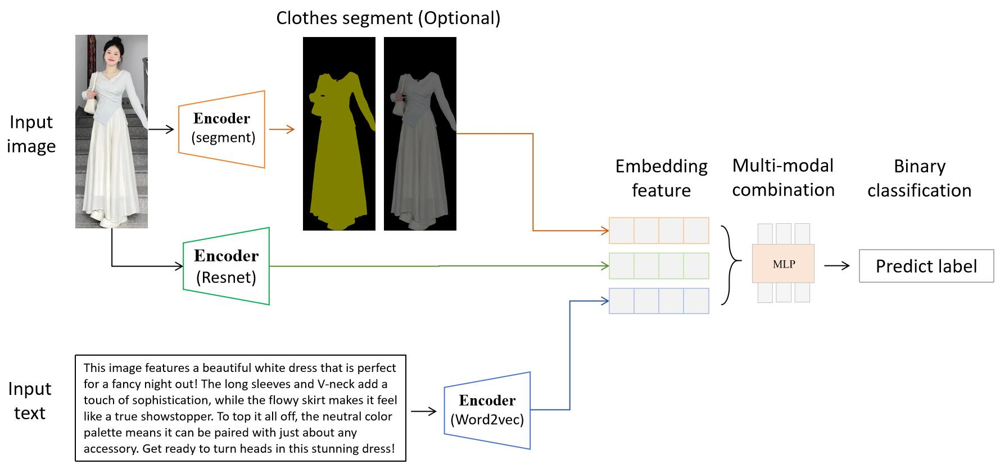

# 多模态识别

## 一、任务目标：

对于社交媒体的人物衣服image和文本帖子text，同时嵌入同一个特征空间。然后训练学习，用于预测未来趋势（二分类，火或不火）

**难点：** 多模态的数据处理，嵌入embedding和融合

## 二、解决方案：

**整体方案:**

<p align="center">
    
<p>
<br>

1. 数据嵌入：
- image数据使用[`resnet`](https://github.com/KaimingHe/deep-residual-networks)进行嵌入,并且考虑使用segment，分割人物衣服去掉无关信息。
- text数据使用[`word2vec`](https://code.google.com/archive/p/word2vec/)进行嵌入。
- 或者对image和text，都使用多模态对齐嵌入工具(如[`imagebind`](https://arxiv.org/abs/2305.05665)或[`imagebind-LLM`](https://arxiv.org/abs/2309.03905))进行嵌入。

2. 模型：
- 采用MLP神经网络

```
mlp = make_pipeline(StandardScaler(), MLPClassifier(hidden_layer_sizes=(512, 256), max_iter=500, random_state=42))
mlp.fit(X_train, y_train)
```

## 三、实验效果：

1. 去小红书爬取250个左右数据。数据格式如[`data`](https://python.langchain.com/v0.1/docs/modules/data_connection/document_transformers/)


## 四、结论：


为什么多模态大模型效果不好/不适合这个任务？


## 五、引用文献：
[`resnet`](https://github.com/KaimingHe/deep-residual-networks)(最好的文本特征提取工具之一)

[`word2vec`](https://code.google.com/archive/p/word2vec/)(最好的图片特征提取工具之一)

MLP


