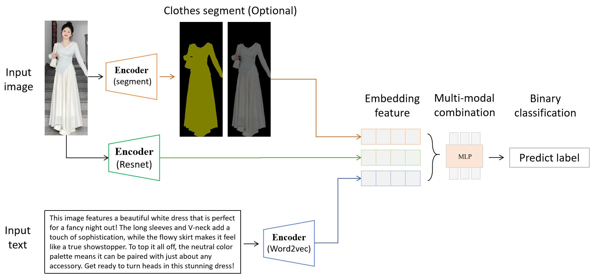

# 多模态识别

## 一、任务目标：

**1. 需求：** 对于社交媒体的人物衣服image和文本帖子text，同时嵌入同一个特征空间。然后训练学习，用于预测未来趋势（二分类，火或不火）

**2. 难点：** 多模态的数据处理(嵌入embedding和融合?)

## 二、解决方案：

### 整体方案:

    

 
上图为方案1的思路。方案2仅替换了不同的Encoder，其余一致。

### 方案1：
- image数据使用[`resnet`](https://github.com/KaimingHe/deep-residual-networks)进行嵌入。并且考虑使用[`segment`](https://github.com/levindabhi/cloth-segmentation)，分割人物衣服去掉无关信息，得到mask。
- text数据使用[`word2vec`](https://code.google.com/archive/p/word2vec/)进行嵌入。
- 模型: 采用MLP神经网络

### 方案2：
- 对image和text，都使用大模型多模态对齐嵌入工具(如[`imagebind`](https://arxiv.org/abs/2305.05665)或[`imagebind-LLM`](https://arxiv.org/abs/2309.03905))进行嵌入。同样考虑使用[`segment`](https://github.com/levindabhi/cloth-segmentation)分割衣服。
- 模型: 采用MLP神经网络

## 三、实验效果：

### 数据准备：

去小红书爬取250个左右数据。数据格式如[`data`](https://github.com/dengxw66/MKT_data_mining/tree/master/Multimodal/data).

- 图片image例子：原始图片样例[`image_sample`](https://github.com/dengxw66/MKT_data_mining/blob/master/Multimodal/data/image_sample.jpg)
- 评论text例子：使用大模型[`ChatGLM`](https://github.com/THUDM/ChatGLM3)生成对应的各种风格语气的对应评论，模拟小红书评论。见[`captions_labeled.json`](https://github.com/dengxw66/MKT_data_mining/blob/master/Multimodal/data/captions_labeled.json)

### 方案1实验：

- 根据方案1,用resnet嵌入图片，用word2vec嵌入文本。

- 结果见[`train_separate.ipynb`](https://github.com/dengxw66/MKT_data_mining/blob/master/Multimodal/predict/train_separate.ipynb)：

| Combination        | Train Accuracy | Test Accuracy |
| :---        |    :----:   |          ---: |
| text + mask + image | 1.0000         | 0.5957        |
| mask + image       | 1.0000         | 0.5532        |
| mask + text        | 1.0000         | 0.5957        |
| image + text       | 1.0000         | _**0.6809**_        |
| only mask          | 0.9784         | 0.5106        |
| only image         | 1.0000         | 0.5957        |
| only text          | 1.0000         | 0.5957        |

### 方案2实验：

- 根据方案2,用imagebind-llm同时嵌入图片和文本。
- 结果见[`train_align.ipynb`](https://github.com/dengxw66/MKT_data_mining/blob/master/Multimodal/predict/train_align.ipynb):

| Combination         | Train Accuracy | Test Accuracy |
| :---        |    :----:   |          ---: |
| text + mask + image | 1.0000         | 0.6383        |
| mask + image        | 1.0000         | 0.5957        |
| mask + text         | 0.9946         | 0.6170        |
| image + text        | 1.0000         | 0.5745        |
| only mask           | 0.9784         | 0.5745        |
| only image          | 1.0000         | 0.6170        |
| only text           | 0.7135         | 0.6809        |

### 结论：

效果最好的是方案1，即[`resnet`](https://github.com/KaimingHe/deep-residual-networks)提取文本特征，然后使用[`word2vec`](https://code.google.com/archive/p/word2vec/)提取图片特征。理由也很自然，因为这两个特征提取模型都是各自领域的State-of-the-Art模型，效果稳定，久经考验。

## 四、讨论：

### 为什么多模态大模型(如[`imagebind`](https://arxiv.org/abs/2305.05665)或[`imagebind-LLM`](https://arxiv.org/abs/2309.03905))效果不好/不适合这个任务？
1. 多模态大模型的数据集和训练过程强调的是图片文本的对齐，即图片翻译理解。并不是特征提取和识别风格。
2. 如果将图片翻译成文本再融合。相比于embedding嵌入为向量，信息损失太多。见表格的`only text`一栏。
3. 大语言模型是基于transformer输出上下文预测，核心能力是上下文补全。不适合这种二分类任务。经典泛用性深度学习网络MLP更加常见和适用于这个任务。

### 后续提高：
1. 更大规模的数据。现在的数据太少，因此训练集的泛化性不够。准确率较低。
2. text的预处理技术。
3. MLP更多的模型架构和微调技术。

