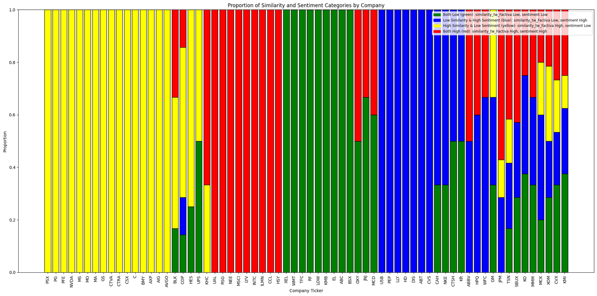
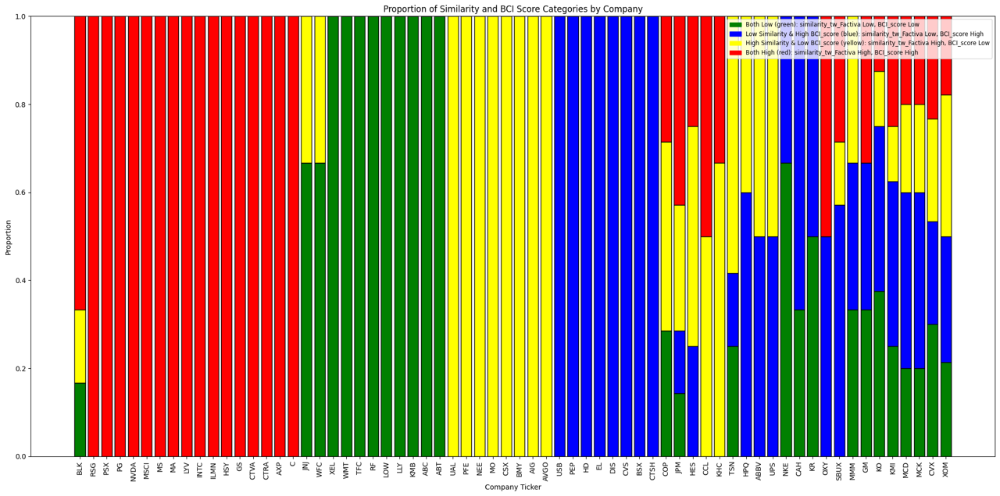
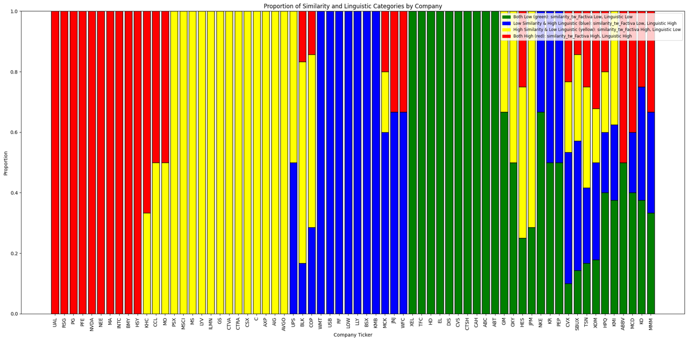
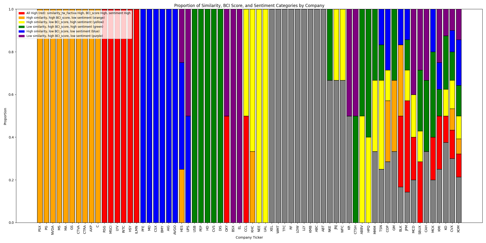
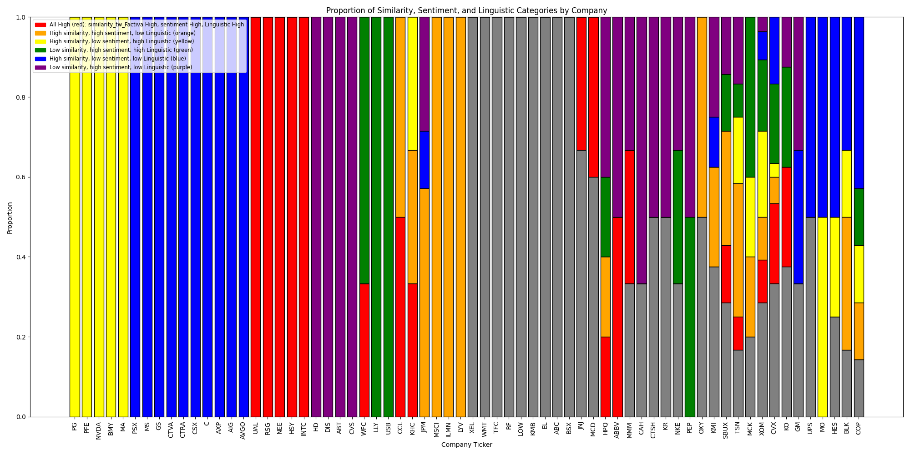
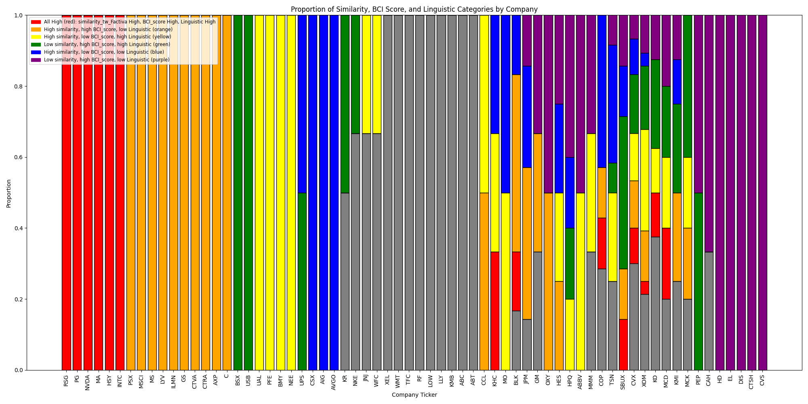
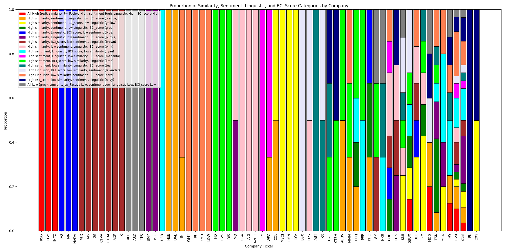
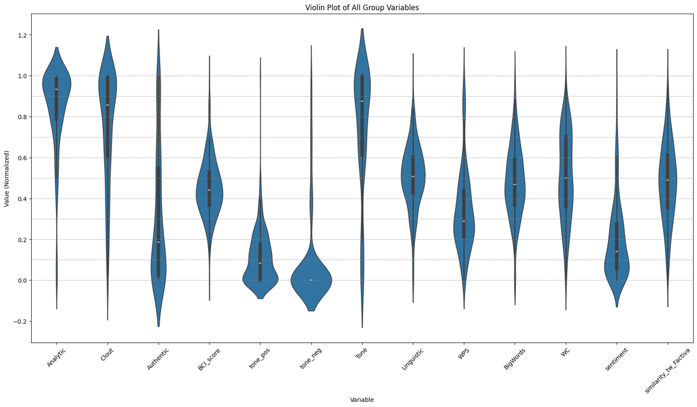

# 变量构建

## 1. 变量定义：

1. 事件回应程度：
    - 直接使用postcontent和TXT度量相似度。值越高，说明post直接回应了事件。如果值很低，说明没有直接回复/存在遮掩。

2. sentiment分析：
    - 使用snowNLP进行度量。返回的值在[0,1]之间。越大表示越积极。

3. 语法复杂性分析：
    - 使用LIWC的语法度量
    - WC (Total word count)
    - WPS (Words per sentence)
    - BigWords (Words longer than 6 letters)
    - Linguistic(统计其中的各种词性(主谓宾形容词副词介词等等)的占比)，值越大，说明语法越复杂。

4. 语气分析:
    使用LIWC分析（详细说明：https://www.liwc.app/help/liwc）
    - Analytic（分析思维）：这个变量衡量文本中的分析思维程度。较高的分数表示语言中反映出更多的逻辑、正式和层次化的思维模式，而较低的分数则表明语言更倾向于直觉和个人化的思维风格。
    - Clout（影响力）：影响力变量反映了语言中所传达的相对社会地位、自信或领导能力。较高的分数表明沟通风格更自信和权威，通常与较高的社会地位相关联。
    - Authentic（真实）：这个变量衡量语言的真实性程度。较高的分数表明文本更加个人化、诚实和公开，而较低的分数则表明沟通风格更加保守或不那么个人化。
    - BCI_score(Tone abstract)：抽象性分析，值越大，说明抽象性越高，具体性concrete越低。
    - tone_pos（积极语气）：这个变量衡量文本中情感语气的积极性。较高的分数表示文本中反映出更多的积极情感词汇和短语。
    - tone_neg（消极语气）：这个变量衡量文本中情感语气的消极性。较高的分数表示文本中反映出更多的消极情感词汇和短语。
    - Tone（情感语气）：情感语气是从积极和消极语气两个变量综合得出的整体情感语气分数，表示语言使用中的一般情感倾向。

## 2. 事件组合的分布

由于有4个维度(事件回应程度，sentiment分析，语法复杂性，语气分析)，因此有8种组合.其中语法复杂性使用Linguistic，语气分析使用BCI_score(Tone abstract)。具体组合情况如下：

- similarity, sentiment, tone_abstract
- similarity, sentiment, linguistic_complex
- similarity, tone_abstract, linguistic_complex
- similarity, sentiment, tone_abstract, linguistic_complex

定义：
    - similarity：直接使用postcontent和TXT度量相似度。值越高，说明post直接回应了事件。如果值很低，说明没有直接回复/存在遮掩。
   - BCI_score(Tone abstract)：抽象性分析，值越大，说明抽象性越高，具体性concrete越低。
   - sentiment：积极和消极，二分类
    - Linguistic(统计其中的各种词性(主谓宾形容词副词介词等等)的占比)，值越大，说明语法越复杂。

情况组合（每个变量都有高低两种情况）：
- similarity, sentiment
- similarity, tone_abstract
- similarity, linguistic_complex

举例：
我们可能可以通过这些变量的一些组合来定义回复策略，比如high similarity＋negative sentiment可能是直接回复问题，low similarity＋positive sentiment可能是通过其他新闻/信息掩盖舆情事件

### 1. Similarity and Sentiment

    
     
    <strong>事件相似度/直接回应程度，sentiment</strong>

- **High similarity, Positive sentiment:** 
  - 意义：此类回复内容高度相关且积极。这可能表示公司正在正面回应事件，试图通过积极的态度来化解问题。

- **High similarity, Negative sentiment:** 
  - 意义：此类回复内容高度相关且消极。这可能表示公司直接承认问题，并表达出消极或不满的情绪，可能在尝试控制舆情。

- **Low similarity, Positive sentiment:** 
  - 意义：此类回复内容不太相关但积极。这可能表示公司试图通过其他积极的信息来转移注意力，掩盖或缓解事件带来的负面影响。

- **Low similarity, Negative sentiment:** 
  - 意义：此类回复内容不太相关且消极。这可能表示公司没有直接回应问题，而是传达了一些消极的信息，可能在尝试混淆或转移注意力。

### 2. Similarity and Tone Abstract (BCI_score)

    
     
    <strong>事件相似度/直接回应程度，抽象程度</strong>

- **High similarity, High tone abstract (high BCI_score):** 
  - 意义：此类回复内容高度相关且抽象。这可能表示公司在回应问题时采用了一些抽象的语言，避免具体细节，可能是为了避免直接承认问题或提供详细解释。

- **High similarity, Low tone abstract (low BCI_score):** 
  - 意义：此类回复内容高度相关且具体。这可能表示公司直接回应问题，并提供了详细的具体信息，试图通过透明度来建立信任。

- **Low similarity, High tone abstract (high BCI_score):** 
  - 意义：此类回复内容不太相关且抽象。这可能表示公司在回应中使用了一些不相关且抽象的语言，可能在尝试转移注意力或掩盖事件。

- **Low similarity, Low tone abstract (low BCI_score):** 
  - 意义：此类回复内容不太相关但具体。这可能表示公司提供了一些不相关但具体的信息，可能在尝试通过细节丰富的其他信息来掩盖事件。

### 3. Similarity and Linguistic Complexity

    
     
    <strong>事件相似度/直接回应程度，Linguistic复杂性</strong>

- **High similarity, High linguistic complexity:** 
  - 意义：此类回复内容高度相关且语法复杂。这可能表示公司在回应问题时采用了复杂的语言结构，可能在尝试通过复杂的语言掩盖实际问题或显得专业。

- **High similarity, Low linguistic complexity:** 
  - 意义：此类回复内容高度相关且语法简单。这可能表示公司直接而简洁地回应问题，试图通过简明扼要的语言建立透明度和信任。

- **Low similarity, High linguistic complexity:** 
  - 意义：此类回复内容不太相关且语法复杂。这可能表示公司在回应中使用了一些不相关但复杂的语言，可能在尝试通过复杂的语言结构转移注意力或掩盖事件。

- **Low similarity, Low linguistic complexity:** 
  - 意义：此类回复内容不太相关且语法简单。这可能表示公司提供了一些不相关且简单的信息，可能在尝试通过简单的信息转移注意力。

### 4. Similarity, Sentiment, Tone Abstract (BCI_score)

    
     
    <strong>事件相似度/直接回应程度，抽象程度，sentiment</strong>

- **High similarity, Positive sentiment, High tone abstract (high BCI_score):**
  - 意义：此类回复内容高度相关且积极，但语言抽象。这可能表示公司正在正面回应事件，使用积极且抽象的语言来避免具体细节，可能在试图缓和问题而不提供详细解释。

- **High similarity, Positive sentiment, Low tone abstract (low BCI_score):**
  - 意义：此类回复内容高度相关且积极，并且语言具体。这可能表示公司直接回应问题，使用积极且具体的信息试图通过透明度来建立信任和解决问题。

- **High similarity, Negative sentiment, High tone abstract (high BCI_score):**
  - 意义：此类回复内容高度相关且消极，并且语言抽象。这可能表示公司承认问题，但通过抽象的语言避免提供具体细节，可能在试图控制舆情而不暴露太多信息。

- **High similarity, Negative sentiment, Low tone abstract (low BCI_score):**
  - 意义：此类回复内容高度相关且消极，并且语言具体。这可能表示公司直接且详细地回应问题，表达不满或消极情绪，可能在尝试全面控制和解决问题。

- **Low similarity, Positive sentiment, High tone abstract (high BCI_score):**
  - 意义：此类回复内容不太相关但积极，且语言抽象。这可能表示公司试图通过抽象且积极的信息转移注意力，缓和事件影响而不直接回应问题。

- **Low similarity, Positive sentiment, Low tone abstract (low BCI_score):**
  - 意义：此类回复内容不太相关但积极，且语言具体。这可能表示公司通过具体且积极的信息试图转移注意力，掩盖或缓解事件影响。

- **Low similarity, Negative sentiment, High tone abstract (high BCI_score):**
  - 意义：此类回复内容不太相关且消极，且语言抽象。这可能表示公司使用抽象且消极的信息来转移注意力或混淆事件，避免直接回应问题。

- **Low similarity, Negative sentiment, Low tone abstract (low BCI_score):**
  - 意义：此类回复内容不太相关且消极，且语言具体。这可能表示公司通过具体且消极的信息来转移注意力，混淆或掩盖事件。

### 5. Similarity, Sentiment, Linguistic Complexity

    
     
    <strong>事件相似度/直接回应程度，sentiment，Linguistic复杂性</strong>

- **High similarity, Positive sentiment, High linguistic complexity:**
  - 意义：此类回复内容高度相关且积极，且语言复杂。这可能表示公司直接回应问题，通过复杂且积极的语言显得专业和正式。

- **High similarity, Positive sentiment, Low linguistic complexity:**
  - 意义：此类回复内容高度相关且积极，且语言简单。这可能表示公司直接且简洁地回应问题，使用简单积极的语言建立透明度和信任。

- **High similarity, Negative sentiment, High linguistic complexity:**
  - 意义：此类回复内容高度相关且消极，且语言复杂。这可能表示公司承认问题，通过复杂且消极的语言表达不满或控制舆情。

- **High similarity, Negative sentiment, Low linguistic complexity:**
  - 意义：此类回复内容高度相关且消极，且语言简单。这可能表示公司直接且简洁地回应问题，表达不满或消极情绪，试图全面控制和解决问题。

- **Low similarity, Positive sentiment, High linguistic complexity:**
  - 意义：此类回复内容不太相关但积极，且语言复杂。这可能表示公司试图通过复杂且积极的语言转移注意力，缓和事件影响而不直接回应问题。

- **Low similarity, Positive sentiment, Low linguistic complexity:**
  - 意义：此类回复内容不太相关但积极，且语言简单。这可能表示公司通过简单且积极的信息转移注意力，掩盖或缓解事件影响。

- **Low similarity, Negative sentiment, High linguistic complexity:**
  - 意义：此类回复内容不太相关且消极，且语言复杂。这可能表示公司使用复杂且消极的语言转移注意力或混淆事件，避免直接回应问题。

- **Low similarity, Negative sentiment, Low linguistic complexity:**
  - 意义：此类回复内容不太相关且消极，且语言简单。这可能表示公司通过简单且消极的信息转移注意力，混淆或掩盖事件。

### 6. Similarity, Tone Abstract (BCI_score), Linguistic Complexity

    
     
    <strong>事件相似度/直接回应程度，抽象程度，Linguistic复杂性</strong>

- **High similarity, High tone abstract (high BCI_score), High linguistic complexity:**
  - 意义：此类回复内容高度相关且抽象，且语言复杂。这可能表示公司回应问题时使用复杂且抽象的语言，避免具体细节，试图显得专业而不直接承认问题。

- **High similarity, High tone abstract (high BCI_score), Low linguistic complexity:**
  - 意义：此类回复内容高度相关且抽象，且语言简单。这可能表示公司回应问题时使用简单且抽象的语言，避免具体细节，试图简洁而不直接承认问题。

- **High similarity, Low tone abstract (low BCI_score), High linguistic complexity:**
  - 意义：此类回复内容高度相关且具体，且语言复杂。这可能表示公司详细回应问题，使用复杂的语言显得专业和透明。

- **High similarity, Low tone abstract (low BCI_score), Low linguistic complexity:**
  - 意义：此类回复内容高度相关且具体，且语言简单。这可能表示公司简洁且详细地回应问题，试图通过透明度和简明语言建立信任。

- **Low similarity, High tone abstract (high BCI_score), High linguistic complexity:**
  - 意义：此类回复内容不太相关且抽象，且语言复杂。这可能表示公司使用复杂且抽象的语言转移注意力或掩盖事件，避免直接回应问题。

- **Low similarity, High tone abstract (high BCI_score), Low linguistic complexity:**
  - 意义：此类回复内容不太相关且抽象，且语言简单。这可能表示公司使用简单且抽象的语言转移注意力或掩盖事件，避免直接回应问题。

- **Low similarity, Low tone abstract (low BCI_score), High linguistic complexity:**
  - 意义：此类回复内容不太相关且具体，且语言复杂。这可能表示公司使用复杂且具体的信息试图通过细节丰富的其他信息来转移注意力或掩盖事件。

- **Low similarity, Low tone abstract (low BCI_score), Low linguistic complexity:**
  - 意义：此类回复内容不太相关且具体，且语言简单。这可能表示公司使用简单且具体的信息转移注意力或掩盖事件。

- similarity, sentiment, linguistic_complex, tone_abstract

    
     
    <strong>事件相似度/直接回应程度，sentiment，Linguistic复杂性，BCI_score</strong>

### 4. Similarity, Sentiment, Tone Abstract (BCI_score), Linguistic Complexity

- **High similarity, Positive sentiment, High tone abstract (high BCI_score), High linguistic complexity:**
  - 意义：此类回复内容高度相关且积极，语言抽象且复杂。这可能表示公司在正面回应问题，使用积极且复杂的语言显得专业，但同时避免具体细节。

- **High similarity, Positive sentiment, High tone abstract (high BCI_score), Low linguistic complexity:**
  - 意义：此类回复内容高度相关且积极，语言抽象但简单。这可能表示公司在正面回应问题，使用积极且抽象的语言避免具体细节，但保持语言简洁。

- **High similarity, Positive sentiment, Low tone abstract (low BCI_score), High linguistic complexity:**
  - 意义：此类回复内容高度相关且积极，语言具体且复杂。这可能表示公司在正面回应问题，使用具体且复杂的语言详细解释，显得专业和透明。

- **High similarity, Positive sentiment, Low tone abstract (low BCI_score), Low linguistic complexity:**
  - 意义：此类回复内容高度相关且积极，语言具体且简单。这可能表示公司在正面回应问题，使用具体且简洁的语言详细解释，建立透明度和信任。

- **High similarity, Negative sentiment, High tone abstract (high BCI_score), High linguistic complexity:**
  - 意义：此类回复内容高度相关且消极，语言抽象且复杂。这可能表示公司承认问题，使用消极且复杂的语言表达不满，但避免具体细节。

- **High similarity, Negative sentiment, High tone abstract (high BCI_score), Low linguistic complexity:**
  - 意义：此类回复内容高度相关且消极，语言抽象但简单。这可能表示公司承认问题，使用消极且抽象的语言表达不满，避免具体细节，保持语言简洁。

- **High similarity, Negative sentiment, Low tone abstract (low BCI_score), High linguistic complexity:**
  - 意义：此类回复内容高度相关且消极，语言具体且复杂。这可能表示公司详细回应问题，使用消极且复杂的语言表达不满，显得专业和透明。

- **High similarity, Negative sentiment, Low tone abstract (low BCI_score), Low linguistic complexity:**
  - 意义：此类回复内容高度相关且消极，语言具体且简单。这可能表示公司详细回应问题，使用消极且简洁的语言表达不满，建立透明度和信任。

- **Low similarity, Positive sentiment, High tone abstract (high BCI_score), High linguistic complexity:**
  - 意义：此类回复内容不太相关但积极，语言抽象且复杂。这可能表示公司试图通过复杂且积极的语言转移注意力，缓和事件影响而不直接回应问题。

- **Low similarity, Positive sentiment, High tone abstract (high BCI_score), Low linguistic complexity:**
  - 意义：此类回复内容不太相关但积极，语言抽象但简单。这可能表示公司试图通过简单且积极的语言转移注意力，缓和事件影响而不直接回应问题。

- **Low similarity, Positive sentiment, Low tone abstract (low BCI_score), High linguistic complexity:**
  - 意义：此类回复内容不太相关但积极，语言具体且复杂。这可能表示公司使用复杂且具体的信息试图通过细节丰富的其他信息来转移注意力或掩盖事件。

- **Low similarity, Positive sentiment, Low tone abstract (low BCI_score), Low linguistic complexity:**
  - 意义：此类回复内容不太相关但积极，语言具体且简单。这可能表示公司使用简单且具体的信息试图转移注意力，掩盖或缓解事件影响。

- **Low similarity, Negative sentiment, High tone abstract (high BCI_score), High linguistic complexity:**
  - 意义：此类回复内容不太相关且消极，语言抽象且复杂。这可能表示公司使用复杂且抽象的语言表达消极情绪，试图转移注意力或掩盖事件。

- **Low similarity, Negative sentiment, High tone abstract (high BCI_score), Low linguistic complexity:**
  - 意义：此类回复内容不太相关且消极，语言抽象但简单。这可能表示公司使用简单且抽象的语言表达消极情绪，试图转移注意力或掩盖事件。

- **Low similarity, Negative sentiment, Low tone abstract (low BCI_score), High linguistic complexity:**
  - 意义：此类回复内容不太相关且消极，语言具体且复杂。这可能表示公司使用复杂且具体的消极信息来转移注意力或掩盖事件。

- **Low similarity, Negative sentiment, Low tone abstract (low BCI_score), Low linguistic complexity:**
  - 意义：此类回复内容不太相关且消极，语言具体且简单。这可能表示公司使用简单且具体的消极信息来转移注意力或掩盖事件。

通过这些组合分析，我们可以更好地理解公司在面对舆情事件时的不同应对策略，如何通过语言和情感的高低组合来回应、转移或掩盖事件。

# 3. 下一步计划

- 整体分布的小提琴图(violinplot), 说明了各个变量的分布聚集程度(量纲已经统一/归一化)
    - 发现：
        - analytic,clout tone，程度较高：说明沟通风格更自信和权威，更多的逻辑、正式和层次化的思维模式。
        - BCI abstract，lingustic，WPS,big word，程度居中：说明语言的复杂性和抽象性适中。
        - authentic，tone_pos,tone_neg,sentiment，程度较低：说明情绪普遍低落负面。authentic低也表明不是那么诚实和公开

    
     
    <strong>整体的分布。小提琴图(violinplot),每个轴越大，说明越聚集</strong>

